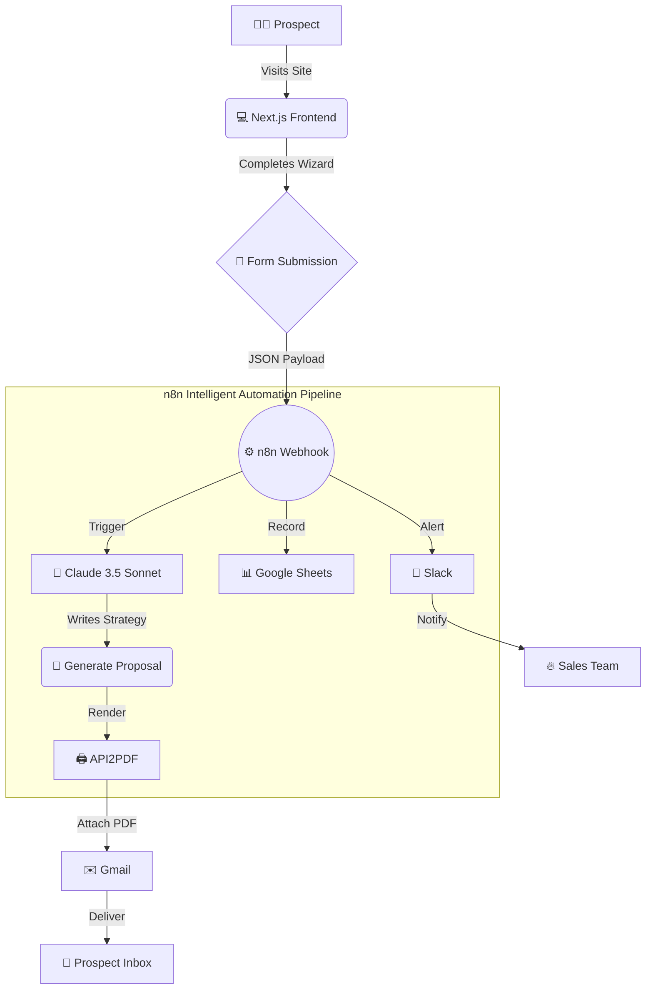
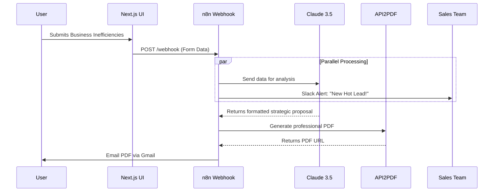

<div align="center">
  
  
  # Business Audit Tool AI
  
  **A Premium, Automated Lead-Generation & Auditing Engine for B2B SaaS**
  
  [](https://nextjs.org)
  [](https://tailwindcss.com)
  [](https://www.framer.com/motion/)
  [](https://n8n.io)

   <!-- TODO: Replace with actual running UI GIF -->
</div>

<br />

## 🎯 The Vision

The **Business Audit Tool AI** is not just a form—it is a deeply engineered, fully automated sales associate. Built with a pristine **split-screen glassmorphism UI**, the frontend captures detailed business inefficiencies and streams them directly into an advanced **n8n AI agent pipeline**.

The result? Within minutes of submission, a highly personalized, beautifully formatted business audit proposal is generated via the latest Anthropic Claude model, converted to a professional PDF, and delivered directly to the prospect's inbox—all while notifying your internal sales team on Slack.

<br />

## 🏛 Architecture Overview

<div align="center">



</div>

<br />

## ✨ Features

- **Jaw-Dropping UI/UX**: A highly polished, split-screen desktop layout featuring a sticky mesh-gradient hero section and frosted glass panels.
- **Interactive Selection Cards**: Replacing boring dropdowns with massive, tactile cards featuring `lucide-react` iconography and glowing hover states.
- **True Native Animations**: Wizard steps slide in and out with perfect physics, powered by Framer Motion.
- **Fully Integrated AI Backend**: Webhook integration with n8n triggers an automated data enrichment and proposal generation pipeline.
- **Zero Jargon**: Engineered to speak peer-to-peer with business owners, translating their inputs into actionable, high-level strategic proposals.

<br />

## 🛠 Tech Stack

### Frontend
- **Framework**: Next.js 14 (App Router)
- **Styling**: Tailwind CSS + Shadcn UI
- **Animations**: Framer Motion
- **State Management & Validation**: React Hook Form + Zod
- **Icons**: Lucide React

### Automation Backend (n8n)
- **AI Brain**: Anthropic Claude 3.5 Sonnet
- **Document Generation**: API2PDF
- **CRM / Delivery**: Google Sheets, Gmail, Slack

<br />

## ⚙️ The n8n Flywheel Pipeline

The backend of this tool is driven by a massive, custom-built n8n automation flow (`n8n-workflow.json`):

<div align="center">



</div>

1. **Webhook Capture**: Instantly catches the form data.
2. **AI Analysis**: Claude 3.5 Sonnet analyzes the inputs (Industry, Tech Stack, Hours Wasted).
3. **Proposal Drafting**: Generates a peer-to-peer, highly professional strategic proposal.
4. **PDF Generation & Delivery**: Converts the proposal into a PDF and emails it directly to the prospect.
5. **Team Notification**: Alerts the internal team via Slack that a hot lead just came in.

<br />

## 🚀 Getting Started

To run the jaw-dropping frontend locally:

```bash
# 1. Clone the repository
git clone https://github.com/avuzmal/business.audit.tool.ai.git

# 2. Navigate into the directory
cd business.audit.tool.ai

# 3. Install dependencies
npm install

# 4. Start the local development server
npm run dev -p 4000
```
Open [http://localhost:4000](http://localhost:4000) with your browser to see the result.

<br />

<div align="center">
  <i>Engineered for unparalleled conversion rates.</i>
</div>
